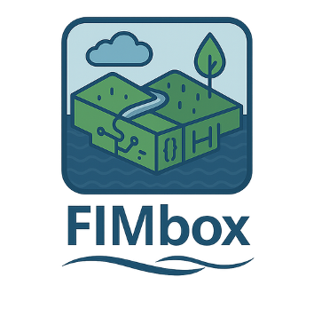
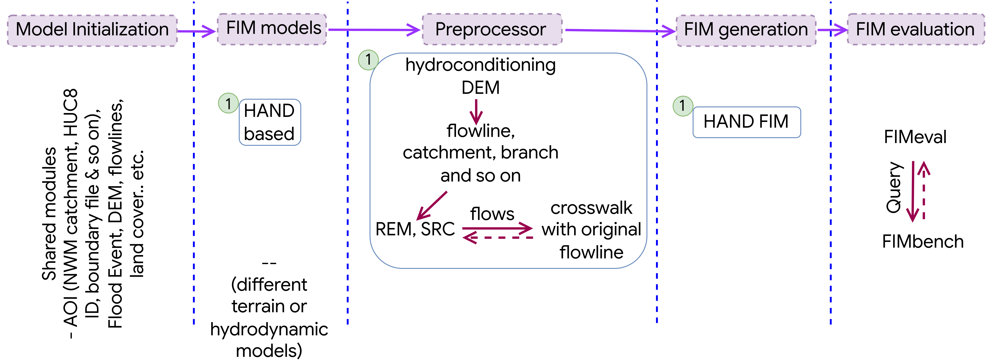

<div align="center">
  
  <h2>FIMbox- A Testbed for Flood Inundation Mapping Experimentation</h2>
  <p>
    <a href="https://github.com/sdmlua/fimbox/releases"></a>
    <a href="https://github.com/sdmlua/fimbox/issues"></a>
    <a href="https://github.com/sdmlua/fimbox/blob/main/LICENSE"></a><br>
    <a href="https://github.com/astral-sh/ruff"></a>
    <a href="https://www.python.org/"></a><br>
    <a href="https://pypi.org/project/fimbox/"></a>
    <a href="https://pepy.tech/projects/fimbox"></a>
  </p>
</div>

A modular open-source testbed framework to standardize Flood Inundation
Mapping (FIM) simulations and evaluation with custom datasets and
hydrologic parameters in reproducible workflows.

## High-level workflow
---
It consists of extentsive Height Above Nearest Drainage (HAND) based flood-inundation mapping. The workflow provice greater flexibility on changing different datasets  (e.g. resolution and source of river networks, catchments, DEMs), investigate different research questions (e.g. changing manning n, better representation of synthetic rating curve, stream network segmentation, slope improvement and many more terrain conditioning) to improve the FIM extent and depths!

The ongoing work is includes expand the FIM modeling capability beyond a single model- integrating different model to enable multimodel FIM extent, and more. 
<div align="center">
  
</div>
---

## Install
---

`fimbox` targets Python 3.10–3.12.

```bash
git clone https://github.com/sdmlua/fimbox.git
cd fimbox

# uv-based environment (recommended)
pip install uv
uv venv
uv pip install -e .
```

Activate the virtual environment before running any commands:

**Mac / Linux**
```bash
source .venv/bin/activate
```

**Windows (Command Prompt)**
```cmd
.venv\Scripts\activate.bat
```

**Windows (PowerShell)**
```powershell
.venv\Scripts\Activate.ps1
```

If you prefer Conda, create and activate the environment first, then run
`uv pip install -e .` inside it.


## Quick start: from boundary polygon to flood map
---
### 1. Stage AOI inputs

Download the DEM, NHD/NWM hydrography, FEMA NFHL, NLD levees, OSM
bridges/roads, and USGS gages into an AOI working directory.

```python
from fimbox import getAllInputData

getAllInputData(
    boundary="path/to/aoi_boundary.gpkg",
    aoi_id="my_basin",
    out_dir="out/my_basin",
)
```
see the ```tests/``` folder for further detailed steps inclduing- HAND processing, SRC genetation, calibration and FIM generation. User can change different parameters based on requirements.

## Contribution
---
For contribution guidelines see [`CONTRIBUTING.md`](CONTRIBUTING.md).

## Acknowledgements
---
In `fimbox`, the HAND preprocessing implementation uses logic and workflow from NOAA OWP HAND-FIM
framework. The original reference implementation lives at:
https://github.com/NOAA-OWP/inundation-mapping

## Funding
---
Funding for this project was provided by the National Oceanic & Atmospheric Administration (NOAA), awarded to the Cooperative Institute for Research to Operations in Hydrology (CIROH) through the NOAA Cooperative Agreement with The University of Alabama (NA22NWS4320003).


## Contact
---
`fimbox` is developed at the
[Surface Dynamics Modeling Lab (SDML)](https://sdml.ua.edu/) at The
University of Alabama.

Sagy Cohen (sagy.cohen@ua.edu), Supath Dhital (sdhital@ua.edu)

‼️ NOTE- This repository is still in active development, and might contain bugs, please let us know or create pull request , if you have better ideas. THANK YOU.