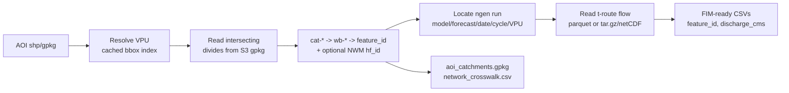

### NextGen-in-a-Box Integration

This part of fimbox connects your **area of interest** (a map outline of the place you care about) to NextGen streamflow data, so that flood maps can be produced for that area.

In simple terms, you hand it a shapefile or geopackage of an area, and it figures out which rivers and drainage areas fall inside that shape, then goes and fetches how much water is flowing in each of them. 

**What you give it**

- An **area of interest** — a boundary file (a `.shp` shapefile or a `.gpkg` GeoPackage) outlining the region you want. For example, a city, a watershed, or a study site.

**What you get back**, saved in a folder named after your area:

- A **catchments** map file — the drainage areas that fall inside your boundary.
- A **discharge** table — how much water is flowing in each of those areas (in cubic metres per second).
- The **stream IDs** — the identifiers that link each drainage area to its river reach.

Everything is downloaded from a [free public s3 bucket](https://ciroh-community-ngen-datastream.s3.amazonaws.com/index.html).

### How to run it

The simplest way, from a terminal:

```bash
python -m fimbox.nextgen my_area.shp --out-dir out
```

Replace `my_area.shp` with the path to your boundary file. Results land in `out/my_area/`.

Or from Python, in one line:

```python
import fimbox

result = fimbox.getNextGenAOI("my_area.shp", out_dir="out")

print(result.catchments_path)   # the catchments map file
print(result.discharge_csvs)    # the water-flow table(s)
print(result.feature_ids)       # the stream IDs
```

By default it grabs the **most recent** available forecast.

**Output folder structure**

```
out/my_area/
  feature_id.csv                 the list of stream IDs
  hydrofabric/
    aoi_catchments.gpkg          the catchments (drainage areas) map
    aoi_flowpaths.gpkg           the rivers/streams inside your area
    network_crosswalk.csv        a lookup table linking IDs together
  discharge-inputs/
    nextgen_..._maximum.csv      the water-flow numbers for each stream
```

### A few useful options

You can add these to the command above:

- `--no-discharge` — just find the catchments and IDs, skip downloading the water-flow data (faster).
- `--date 20260721 --cycle 09` — use a specific day/time instead of the latest.
- `--forecast medium_range` — use a longer-range forecast (default is `short_range`).
- `--sortby maximum` — for each stream, keep the **peak** flow over the forecast (the default, best for flood extent). Other choices: `minimum`, `mean`, or `none` to keep every hour.


---

### Developer reference

`fimbox.nextgen` maps an AOI to the NOAA/OWP **NextGen v2.2 hydrofabric** and the ngen/t-route **discharge** published on the public [CIROH community NextGen DataStream](https://ciroh-community-ngen-datastream.s3.amazonaws.com) S3 bucket.

**How the crosswalk works.** Each NextGen divide (`divide_id` = `cat-<n>`) drains to exactly one flowpath (`id` = `wb-<n>`). The integer `<n>` is the `feature_id` used in the ngen/t-route outputs, so catchment → flowpath → discharge is a direct join. The `network` layer also carries `hf_id` (the NWM COMID), available as an optional crosswalk (`nwm_crosswalk=True`, slower because it scans that table over S3).



Newer runs store discharge as `ngen-run/outputs/troute/troute_output_*.parquet`; older runs as an `ngen-run.tar.gz` containing `outputs/troute/*.nc`. Both are handled transparently.

**Module contents**

| File | What it contains |
|---|---|
| `hydrofabric.py` | `NextGenHydrofabric` / `AOIHydrofabric`: AOI → VPU resolution, intersecting `divides`, and the `cat`/`wb`/`feature_id`(+`hf_id`) crosswalk. `build_vpu_index()` regenerates the cached VPU bbox index. |
| `datastream.py` | `NextGenDatastream` / `DischargeRun`: locate an ngen run on the bucket (default `cfe_nom` / `short_range` / latest), read t-route `flow` for the feature ids, and write FIM-ready CSVs. |
| `pipeline.py` | `NextGenAOI` and `getNextGenAOI`: AOI → catchments + discharge in one call, written into the standard fimbox AOI layout. Also the module CLI. |
| `_common.py` | Bucket constants, anonymous S3 handle, AOI-layout helpers, the cached VPU bbox index, and `wb`→`feature_id` parsing. |
| `data/vpu_bbox.json` | Per-VPU bounding boxes (EPSG:5070) so AOI→VPU resolution needs no network round-trip. |

**Full Python API**

```python
import fimbox

res = fimbox.getNextGenAOI(
    "my_aoi.shp",                 # AOI shapefile / GeoPackage / GeoJSON
    out_dir="out",                # AOI folder created at out/<aoi_stem>
    # aoi_layer=None,             # layer name for a multi-layer gpkg
    # predicate="intersects",     # or "within" (catchments fully inside the AOI)
    # nwm_crosswalk=False,        # also resolve NWM hf_id/COMID (slower S3 read)
    # model="cfe_nom",            # ngen model output set
    # forecast="short_range",     # short_range | medium_range | analysis_assim_extend
    # date=None, cycle=None,      # YYYYMMDD + cycle hour; default latest available
    # sortby="maximum",           # horizon aggregation: maximum|minimum|mean|None
    # at_time=None,               # single timestamp instead of aggregating
    # fetch_discharge=True,       # False -> resolve catchments/ids only
)

res.catchments_path   # <AOI>/hydrofabric/aoi_catchments.gpkg
res.feature_ids       # NextGen feature_ids == streamflow network ids
res.network_ids       # wb-* flowpath ids
res.discharge         # long DataFrame [feature_id, time, flow] (flow in cms)
res.discharge_csvs    # FIM-ready CSVs in <AOI>/discharge-inputs/
res.run               # e.g. "cfe_nom/short_range/ngen.20260721/09/VPU_03N"

# Step-by-step (class-based)
from fimbox.nextgen import NextGenHydrofabric, NextGenDatastream

hf = NextGenHydrofabric("my_aoi.shp").resolve()      # AOIHydrofabric
ds = NextGenDatastream(hf.vpus[0])                   # latest cfe_nom short_range run
flow = ds.read_discharge(hf.feature_ids)             # [feature_id, time, flow]
csvs = ds.to_fim_inputs("out/my_aoi", hf.feature_ids, sortby="maximum")
```

**Notes**

- The bucket is read anonymously; no AWS credentials are required.
- `feature_id.csv` and `discharge-inputs/` match the `fimbox.streamflow` layout, so NextGen discharge is a drop-in alternative to the NWM/GEOGLOWS sources for FIM generation.
