### Preprocessing
<hr style="border: 1px solid blue;">

**fimbox.preprocessing** turns a boundary polygon, a HUC8 ID, or a list of NWM reach IDs into everything HAND-FIM needs: staged input datasets, hydro-conditioned DEMs, branch-level HAND rasters, synthetic rating curves (SRCs), and calibrated hydroTables. It is the largest module in `fimbox` and is organized as one subpackage per stage.

**Workflow**

The pipeline moves an AOI from a raw boundary to a fully calibrated, FIM-ready dataset in five stages. Each stage writes its outputs into the AOI folder and feeds the next, so the chain can be run end-to-end or stage-by-stage. The entry point is flexible: pass your own boundary polygon, an 8-digit HUC8 ID, NWM reach IDs, or ngen catchment IDs, and every major dataset can be swapped: 3DEP DEM at any resolution or your own DEM, NWM medium-resolution, NHDPlus High-Resolution or NextGen (ngen) hydrofabric hydrography, or your own flowlines/catchments. Bridge DEM processing is optional and only needed when bridge decks should be healed in the HAND raster.

**Choosing the AOI**

| Input | AOI becomes | Default buffer |
|---|---|---|
| `boundary="aoi.gpkg"` | the polygon you supply | 2000 m |
| `huc8="03020201"` | that HUC8 watershed | 2000 m |
| `nwm_ids=[5091042, ...]` | dissolved footprint of those reaches' catchments | 0 m |

Reach-ID runs target an exact set of catchments, so they default to no buffer. `buffer_m` then decides how much hydrography is staged:

- **`buffer_m=0`** (default) — the stream network is exactly the reaches requested; neighbours touching the AOI are not pulled in.
- **`buffer_m>0`** — the buffered AOI is re-queried, so reaches inside the buffer come too. This is usually what you want for HAND, since flow accumulation at the AOI edge needs the upstream contributing area.

`buffer_m` overrides the default in any mode.

Use `getAllInputDataBatch` for several AOIs at once. Grouping is explicit and never guessed from geography:

```python
fimbox.getAllInputDataBatch(nwm_ids=[101, 102])                  # one AOI holding both
fimbox.getAllInputDataBatch(nwm_ids=[[101, 102], [201]])         # one AOI per inner list
fimbox.getAllInputDataBatch(nwm_ids=[101, 102], separate=True)   # one AOI per reach

fimbox.getAllInputDataBatch(hucs=["03020201", "03020202"])       # one AOI per HUC
fimbox.getAllInputDataBatch(hucs=[["03020201", "03020202"]])     # one combined AOI
fimbox.getAllInputDataBatch(hucs=[...], together=True)           # one combined AOI
```

A flat HUC list is one AOI per HUC, matching how FIM is normally run; a flat reach list is one AOI. Nesting groups either kind, and `separate` / `together` override.

Each AOI gets its own folder, named after the first ID in its group: `nwm_5091042` for a single reach, `nwm_5091042and1more` when the group holds several, and `HUC03020201` / `HUC03020201and1more` for HUCs. **The files inside are always the canonical names** — a group's catchments are merged into one boundary written as `wbd.gpkg`, so anything reading `wbd.gpkg`, `dem.tif`, or `<identifier>_subset_streams.gpkg` works the same no matter which input mode built the AOI.

When an AOI resolves to a single reach there is no network to split, so branch derivation writes an empty branch list and branch zero alone covers the AOI — see [`calculate_branch/`](calculate_branch/).

<!-- Diagram source: workflows/preprocessing.mmd - edit that file and regenerate with `make workflows` (see workflows/README.md) -->
<div align="center">
  
</div>

**Module contents**

| Path | What it contains |
|---|---|
| [`download_data/`](download_data/) | Download and standardize all AOI inputs (DEM, NWM/NHDPlus hydrography, FEMA NFHL, NLD levees, OSM roads/bridges, USGS gages). |
| [`huc_test/`](huc_test/) | Validate HUC8 codes against the acceptable HUC lists shipped with the package. |
| [`process_bridgedem/`](process_bridgedem/) | Build per-bridge LiDAR elevation rasters and the bridge/DEM difference raster used to heal bridge decks in HAND. |
| [`calculate_branch/`](calculate_branch/) | Branch derivation and the per-branch HAND workflow: DEM conditioning, flow direction/accumulation, REM/HAND, reach splitting, crosswalk, and SRC/hydroTable generation. |
| [`calibrate_ratingcurve/`](calibrate_ratingcurve/) | SRC calibration: bathymetry, bankfull, channel/overbank subdivision, USGS/spatial/manual calibration, and AOI aggregation. |
| `preprocess_area.py` | `getAllInputData`: the combined download pipeline that stages every AOI input in one call. `getAllInputDataBatch` runs it across several AOIs. |
| `aoi_from_ids.py` | Build AOI boundaries from HUC IDs or NWM reach IDs (`resolve_reach_group`, `reaches_to_boundary`, `hucs_to_boundary`) and resolve id lists into AOI groups. |
| `source_naming.py` | Filename conventions (`source_name`, `detect_identifier`, `resolve_source`) so alternative hydrography sources can replace NWM transparently. |

**Order of operations**

1. `getAllInputData` stages inputs under `<out_dir>/<aoi_id>/watershed-data/`.
2. (Optional) `generateBridgeRaster` + `BridgeDEMDiff` produce `bridge_elev_diff.tif`.
3. `BranchDerivation` + `calculate_allbranches` produce per-branch HAND rasters, SRCs, and hydroTables.
4. `run_calibration` adjusts and calibrates the SRCs/hydroTables.

### Usage
<hr style="border: 1px solid blue;">

```python
import fimbox

# Stage all AOI inputs from a boundary polygon (or huc8="03020201", or nwm_ids=[...])
pp = fimbox.getAllInputData(
    boundary="path/to/aoi_boundary.gpkg",   #AOI polygon file (alternative to huc8/nwm_ids)
    out_dir="out/my_basin",                 #root output directory (default fimbox_preprocess)
    # huc8: Optional[str] = None,           #8-digit HUC ID instead of a boundary file
    # nwm_ids: Optional[Sequence] = None,   #NWM reach IDs; AOI = their catchment footprint
    # boundary_layer: Optional[str] = None, #layer name when boundary is a multi-layer gpkg
    # epsg: int = 5070,                     #output CRS (NAD83 CONUS Albers)
    # dem_resolution: int = 10,             #3DEP DEM resolution in meters (1/3/10/30/60)
    # buffer_m: Optional[float] = None,     #buffer for downloads; 2000 m, or 0 with nwm_ids
    # headwater_buffer_cells: int = 8,      #DEM cells for the inner headwater clip (capped by buffer_m)
    # get_flowlines: bool = True,           #download flowlines (False = bring your own)
    # get_catchments: bool = True,          #download catchments (False = bring your own)
    # source: str = "nwmmedium",            #"nwmmedium" = NWM, "nwmhigh" = NHDPlus HR, "ngen" = NextGen hydrofabric
    # cat_ids: Optional[Sequence] = None,   #ngen catchment IDs (implies source="ngen")
    # feature_ids: Optional[Sequence] = None, #NWM comids resolved against the ngen hydrofabric
    # subset_type: str = "nexus",           #"nexus" = up to the outlet nexus, "catchment" = stop at the seed
    # flowlines: Optional[Path] = None,     #bring-your-own flowlines file
    # catchments: Optional[Path] = None,    #bring-your-own catchments file
    # stream_fields: Optional[dict] = None, #canonical->user column map for custom streams
    # catchment_fields: Optional[dict] = None, #canonical->user column map for custom catchments
    # identifier: str = "nwm",              #filename prefix for staged hydrography
    # dem: Optional[Path] = None,           #bring-your-own DEM (reprojected/clipped)
)
pp.run()        # full pipeline; or pp.run_dem() / pp.run_nhd() / pp.run_nld() / pp.run_osm() individually

# Several AOIs in one call — see "Choosing the AOI" above for grouping rules
aois = fimbox.getAllInputDataBatch(
    nwm_ids=[[5091042, 5091044], [11908106]],  #one AOI per inner list
    out_dir="out",
    # hucs: Optional[Sequence] = None,      #HUC IDs; flat list = one AOI per HUC
    # separate: bool = False,               #split every group into single-id AOIs
    # together: bool = False,               #merge all groups into one AOI
    # run: bool = True,                     #False builds the AOIs without downloading
    # continue_on_error: bool = True,       #log and carry on when one AOI fails
)                                           #plus any getAllInputData parameter
```

Each subpackage README documents its own classes and parameters; the branch and calibration steps are driven through `AOIProcessingConfig`, `calculate_allbranches`, and `run_calibration`.

**For more usage notes refer to the [tests](../../../tests/) or [docs](../../../docs/) for the `fimbox` python package.**
