### Branch Processing (HAND + SRC Generation)
<hr style="border: 1px solid blue;">

**fimbox.preprocessing.calculate_branch** derives stream branches (level paths) from the staged hydrography and runs the full per-branch HAND workflow: DEM conditioning, D8 flow direction/accumulation, relative elevation model (HAND), reach splitting, catchment filtering, NWM crosswalk, and synthetic rating curve (SRC) / hydroTable generation.

**Workflow**

The stream network is split into branches (level paths) that are processed independently: branch zero runs first, then every other branch is dispatched to the shared Dask scheduler, which spreads the branch pipelines across all available CPU cores (`n_workers`). The whole chain can be run at once with `calculate_allbranches`, or driven step-by-step (`BranchDerivation` &rarr; `BranchZero` &rarr; per-branch processing) with identical results. Staged files re-enter the pipeline midway: headwater points seed flow accumulation, the bridge elevation difference heals decks right after HAND, and NWM catchments drive the crosswalk.

**Single-reach AOIs.** A lone reach has no network to split, so `BranchDerivation` writes an empty `branch_ids.lst` and leaves the AOI to branch zero, which already covers it. This skips level-path dissolve, headwater seeding, branch polygons, and the per-branch DEM clips — and avoids the headwater-seed-on-level-path requirement that non-zero branches carry. Set `single_levelpath_branch_zero_only=False` to force the normal level-path path instead.

<!-- Diagram source: workflows/calculate_branch.mmd - edit that file and regenerate with `make workflows` (see workflows/README.md) -->
<div align="center">
  
</div>

**Module contents**

| File | What it contains |
|---|---|
| `branch_derivation.py` | `BranchDerivation`: derive level paths, branch polygons, and the branch list from staged streams/catchments. |
| `process_branches.py` | `AOIProcessingConfig` (all AOI/branch settings in one object) and `process_branches`: parallel multi-branch orchestrator. |
| `calculate_allbranches.py` | `calculate_allbranches`: full AOI loop: BranchZero, all branches in parallel, cleanup, `branch_ids.csv` registry. |
| `calculate_branchzero.py` | `BranchZero`: branch-zero preprocessing: DEM clip, stream/levee rasterize, AGREE conditioning, pit fill, D8 flow direction. |
| `create_hand.py` | `CreateHAND`: the 22-step per-branch pipeline from flow accumulation to hydroTable. |
| `hydroenforce_dem.py` | AGREE DEM hydrological conditioning (stream-aligned valley carving). |
| `adjust_floodplains.py` | FEMA NFHL floodplain DEM adjustment via distance-decay from burned streams. |
| `flowdir_dem.py` | D8 flow direction (WhiteboxTools) and D8 slope computation. |
| `flowacc_dem.py` | D8 flow accumulation seeded from headwater points. |
| `thalweg_adjustment.py` | Lateral thalweg minimum replacement and flow-conditioned DEM. |
| `make_rem.py` | REM/HAND computation (catchment minima, then pixel differences). |
| `mask_to_catchments.py` | REM zero-clip and slope masking to filtered catchment footprints. |
| `streamnet_reaches.py` | Stream network vectorization from rasters (headwater to confluence to outlet). |
| `split_reaches.py` | Reach splitting at boundaries/lakes/length limits; HydroID assignment; NextDownID topology. |
| `filter_catchments.py` | Drop tiny catchments/reaches and slivers; attach area/slope attributes. |
| `reach_rasterize.py` | Boolean-grid rasterization of streams, level paths, and headwater points. |
| `levee_rasterize.py` | 3D NLD levee rasterization from Z vertices, DEM burning, and area masking. |
| `add_crosswalk.py` | Crosswalk DEM-derived reaches to NWM feature_ids and build the SRC with Manning hydraulics. Seeds the hydroTable's bathymetry / subdivision / calibration placeholder columns so the schema is fixed from creation. |
| `evaluate_crosswalk.py` | Crosswalk accuracy diagnostics (overlap and network topology checks). |
| `build_src.py` | SRC base table: per-catchment geometry accumulation over the stage ladder. |
| `stages_catchlist.py` | Stage-ladder and per-HydroID metadata files for the SRC build. |
| `gage_catchments.py` | Gage watershed delineation via reverse-D8 label propagation. |
| `gage_crosswalk.py` | USGS/AHPS gage assignment to branches and DEM elevation sampling per gage. |
| `heal_bridges_osm.py` | OSM bridge deck elevation burn into the HAND raster. |
| `process_roads_fimpact.py` | OSM road minimum-HAND sampling for flooding-threshold derivation. |
| `convert_to_int16.py` | Int16 downcast of HydroID and HAND rasters for storage optimization. |
| `outputs_cleanup.py` | Deny-list cleanup of intermediate files per branch and AOI. |
| `_wbt_safe.py` | Thread-safe WhiteboxTools invocation with per-process homes. |

### Usage
<hr style="border: 1px solid blue;">

```python
from pathlib import Path
import fimbox

OUT_DIR = Path("out/my_basin/watershed-data")

# 1. Derive branches (level paths + branch polygons + branch list)
fimbox.BranchDerivation(
    out_dir=OUT_DIR,                             #staged input directory from getAllInputData
    # area_id: Optional[str] = None,             #AOI identifier (defaults to folder name)
    # branch_id_attribute: str = "levpa_id",     #column holding branch (level path) IDs
    # reach_id_attribute: str = "ID",            #reach ID column in the stream network
    # stream_order_attribute: str = "order_",    #stream order column
    # branch_buffer_distance_meters: float = 7000.0, #branch processing polygon buffer (m)
    # excluded_stream_orders: tuple = (1, 2),    #stream orders left to branch zero only
    # stream_network / catchments / lakes / boundary / headwaters / levees: Optional[Path], #file overrides
    # levee_id_attribute: str = "SYSTEM_ID",     #levee system ID column
    # levee_buffer: float = 1000.0,              #levee association buffer (m)
    # single_levelpath_branch_zero_only: bool = True, #1 reach -> empty branch list, branch zero only
).run()

# 2. Configure the AOI once, then run every branch
cfg = fimbox.AOIProcessingConfig(
    aoi_dir=OUT_DIR,                             #AOI root (required)
    dem_path=OUT_DIR / "dem.tif",                #conditioned DEM (required)
    streams_gpkg=OUT_DIR / "nwm_subset_streams.gpkg",  #stream network (required)
    boundary_gpkg=OUT_DIR / "wbd_buffered.gpkg", #clipping boundary (required)
    catchments_gpkg=OUT_DIR / "nwm_catchments_proj_subset.gpkg",  #NWM catchments for crosswalk
    levelpaths_gpkg=OUT_DIR / "nwm_subset_streams_levelPaths.gpkg",  #level-path streams
    # branch_list_path: Optional[Path] = None,   #branch list from BranchDerivation
    # - optional inputs (omit to skip the related step) -
    # bridge_elev_diff_path: Optional[Path] = None, #bridge_elev_diff.tif from process_bridgedem
    # levee_gpkg_path / levee_raster_path: Optional[Path] = None, #3D levees to burn
    # headwaters_gpkg: Optional[Path] = None,    #headwater points
    # levelpaths_extended_gpkg: Optional[Path] = None, #extended level paths per branch
    # fema_nfhl_gpkg: Optional[Path] = None,     #FEMA NFHL for floodplain adjustment
    # usgs_gages_gpkg / ahps_gpkg / ras_locs_gpkg: Optional[Path] = None, #gage crosswalk inputs
    # - CRS / identifiers -
    # target_crs: Union[str, int] = 5070,        #working CRS
    # branch_zero_id: str = "0",                 #branch-zero identifier
    # - AGREE + floodplain tuning -
    # agree_buffer_m: float = 15.0,              #AGREE stream buffer (m)
    # agree_smooth_drop: float = 10.0,           #AGREE smooth drop (m)
    # agree_sharp_drop: float = 1000.0,          #AGREE sharp drop (m)
    # floodplain_distance_threshold: float = 7.0, #NFHL decay distance threshold
    # floodplain_slope_exponent: float = 1.0,    #NFHL decay slope exponent
    # floodplain_z_factor: float = 0.5,          #NFHL vertical adjustment factor
    # fema_floodplain_layer: str = "combined",   #NFHL layer choice
    # - HAND tuning -
    # cost_distance_tolerance: float = 50.0,     #lateral thalweg search distance (m)
    # lateral_elevation_threshold: int = 10,     #max elevation drop for lateral replacement (m)
    # max_split_distance_m: float = 1500.0,      #max reach segment length (m)
    # slope_min: float = 0.0001,                 #minimum reach slope
    # lakes_buffer_dist_m: float = 100.0,        #lake exclusion buffer (m)
    # - SRC / crosswalk tuning -
    # mannings_n: float = 0.06,                  #default channel roughness
    # stage_min_m: float = 0.0,                  #SRC stage ladder minimum (m)
    # stage_interval_m: float = 0.3048,          #SRC stage interval (m, 1 ft)
    # stage_max_m: float = 25.2984,              #SRC stage ladder maximum (m)
    # min_catchment_area: float = 0.25,          #drop catchments smaller than this (km2)
    # min_stream_length: float = 0.5,            #drop reaches shorter than this (km)
    # crosswalk_max_distance_m: float = 100.0,   #max snap distance for NWM crosswalk (m)
    # src_slope_source: str = "dem",             #reach slope source: "dem" (computed rise/run) | "hfab"
    # - execution -
    # evaluate_crosswalk: bool = False,          #write crosswalk diagnostics
    # convert_to_int16: bool = False,            #downcast HAND/HydroID rasters to Int16
    # run_branch_zero_usgs_crosswalk: bool = False, #also crosswalk gages on branch zero
    # delete_deny_list: bool = True,             #apply deny-list cleanup per branch
    # keep_failed_branches: bool = False,        #keep outputs of failed branches
    # deny_branch_zero_list / deny_branches_list: Optional[Path] = None, #deny-list overrides
    # n_workers: int = 1,                        #parallel branch workers
    # timeout_seconds: Optional[int] = None,     #per-branch timeout
)

result = fimbox.calculate_allbranches(
    cfg,                                         #AOIProcessingConfig above
    # run_branch_zero: bool = True,              #run BranchZero (skip if already computed)
    # delete_deny_list: bool = True,             #AOI-level cleanup after the branch loop
    # deny_unit_list: Optional[Path] = None,     #deny-list file (default bundled deny_unit.lst)
    # branch_ids_csv: Optional[Path] = None,     #branch registry path (default <aoi>/branch_ids.csv)
)
```

**Key outputs** (per branch under `<aoi>/branches/<id>/`): HAND raster `rem_zeroed_masked_<id>.tif`, crosswalked catchments and reaches (`gw_catchments_reaches_filtered_addedAttributes_crosswalked_<id>.gpkg`), `src_full_crosswalked_<id>.csv`, `hydroTable_<id>.csv`, `src_<id>.json`, plus the AOI-level `branch_ids.csv`.

**For more usage notes refer to the [tests](../../../../tests/) or [docs](../../../../docs/) for the `fimbox` python package.**
