### Rating Curve Calibration
<hr style="border: 1px solid blue;">

**fimbox.preprocessing.calibrate_ratingcurve** adjusts and calibrates the synthetic rating curves (SRCs) and hydroTables produced by branch processing. The pipeline order is: reset (rerun only), pre-aggregation, slope adjustment, thalweg notches, longitudinal filter, bathymetry, bankfull, channel/overbank subdivision, nonmonotonic fix, gage rating-curve calibration, cross-section rating-curve calibration, flood-edge observation calibration, manual calibration, post-aggregation, and log scan. Calibrated discharge is written back per branch as `discharge_cms = precalb_discharge_cms / calb_coef_final`.

**Workflow**

Calibration refines the raw synthetic rating curves in three passes: fix the channel geometry (slope, thalweg notches, longitudinal smoothing, bathymetry), refine the hydraulics (bankfull identification and channel/overbank subdivision), and correct discharge against observations (gage rating curves, cross-section ratings, flood-edge points, manual). The resulting coefficients are applied per feature ID, and the branch tables are rolled up into AOI-level outputs.

**When subdivision applies.** Subdivision needs both `src_subdiv_toggle` and `src_bankfull_toggle`, since it splits geometry at the `Stage_bankfull` column bankfull identification adds. It is then decided per reach: a reach is subdivided only where a usable bankfull flow exists, meaning its `feature_id` is present in `bankfull_flows_file` with a flow above zero (NWM lake and coastal reaches carry zero). Reaches without one keep `subdiv_applied=False` and their original single-`ManningN` discharge — the roughness table is irrelevant to them. Where subdivision does apply, per-`feature_id` values from `vmann_input_file` are used, falling back to `default_channel_n` (0.06) and `default_overbank_n` (0.12) for feature IDs the table does not cover.

The three observation-driven calibrators (`src_adjust_usgs`, `src_adjust_ras2fim`, `src_adjust_spatial`) read the per-stage `channel_n` / `overbank_n` that only subdivision writes, so they run only when subdivision actually ran — toggling `src_subdiv_toggle` without `src_bankfull_toggle` skips them and logs a warning. Note that `channel_n` / `overbank_n` are recorded for every reach, including non-subdivided ones, so a non-null value in those columns does not by itself mean subdivision was applied to that reach; `subdiv_applied` is the flag to read.

**How the two bathymetry sources combine.** `BathymetricAdjustment` runs surveyed channels (`bathy_file_ehydro`) first, then predicted geometry (`bathy_file_aibased`) when `ai_toggle=1`, and the second pass only speaks for the reaches it covers: a `feature_id` the surveys already described keeps its surveyed depth, and the predicted table fills the gaps at stream order `ai_strm_order` and above (below that its depths are zeroed on the way in). The two sources are independent — an unreadable file or an AOI outside one source's extent costs that source only, and is logged as such rather than reported as a success. Each pass records what it folded in as `missing_xs_area_m2` / `missing_wet_perimeter_m` and adds only the difference against it, so applying the step twice without a reset leaves the geometry where it was instead of burying the channel twice as deep.

**Which observation source wins.** The three observation calibrators run in a fixed order — gage rating curves, then cross-section ratings, then flood-edge points — and each one scales from `precalb_discharge_cms`, the geometry-derived discharge snapshotted before any of them ran. They do not compound: a later source overrides the earlier coefficient for the HydroIDs it covers and leaves the earlier one standing everywhere else, so per HydroID the precedence is flood-edge > cross-section > gage, and `obs_source` records which one the surviving `calb_coef_final` came from. Manual calibration is the exception — it runs last and multiplies on top of whatever the others produced, keeping `pre_manual_calb_discharge_cms` as the pre-manual value.

**Rerunning on an already-calibrated AOI is safe**: set `calibration_rerun=True` and `HydroTableReset` restores the uncalibrated baseline before anything else runs, so adjustments never stack on top of a previous calibration. The reset does not need backup files: it recomputes `Discharge (m3s-1)` from the raw per-branch geometry in `src_base_<id>.csv` using Manning's equation with the original `default_SLOPE` and `default_ManningN` stamped during branch processing, pushes that discharge back into both `src_full_crosswalked_<id>.csv` and `hydroTable_<id>.csv`, drops every calibration artefact column (bankfull, subdivision, coefficients), and clears `Bathymetry_source`, leaving the tables exactly as branch processing produced them.

<!-- Diagram source: workflows/calibrate_ratingcurve.mmd - edit that file and regenerate with `make workflows` (see workflows/README.md) -->
<div align="center">
  
</div>

**Module contents**

| File | What it contains |
|---|---|
| `pipeline.py` | `CalibrationConfig` (every knob in one dataclass), `Calibrator`, and the `run_calibration()` entry point. |
| `dem_adjust.py` | `ThalwegNotchesAdjustment`, `LongitudinalFlowFilter`, `BathymetricAdjustment` (surveyed channels or predicted geometry). |
| `src_adjust.py` | `SlopeAdjustment` (swap the slope feeding Manning's), `SrcBankfull` (bankfull stage from reference flows), `SrcSubdiv` (channel/overbank Manning subdivision), `SrcNonmonotonic`. |
| `src_calibrate.py` | `UsgsRatingCalibrator`, `Ras2fimCalibrator`, `SpatialObsCalibrator`, `ManualCalibrator`. |
| `src_optimization.py` | Shared engine: `update_rating_curve()`, network tracing, and downstream coefficient propagation (8 km, roughness window 0.001 to 0.8). |
| `aggregate.py` | `BranchAggregator`: branch to AOI rollup of elev tables, hydroTables, and SRC files. |
| `reset.py` | `HydroTableReset`: rebuild the uncalibrated baseline for reruns: Manning's equation over `src_base` geometry with the default SLOPE/ManningN, calibration columns dropped. |
| `logscan.py` | `LogScanner`: collect error/warning lines from logs into per-AOI summaries. |
| `_common.py` | Shared helpers, dtype maps, and constants. |

**Where slope comes from.** Branch processing sets the baseline on the DEM's own rise/run slope (`src_slope_source`, default `"dem"`; pass `"hfab"` to use the hydrofabric slope instead, with rise/run as its fallback). `SlopeAdjustment` then lays the IRIS-SWORD table over that baseline, which is what `iris_sword_slope` turns on and off. The table is applied only where the reach is order >= 4 **and** the value falls inside `[9.999e-7, 0.5]` — everything else keeps its rise/run slope, so partial coverage is the norm rather than a gap. Only the `sqrt(SLOPE)` term is recomputed; geometry is untouched and the pre-adjustment value is kept as `preslope_SLOPE`. Point `slope_table` at your own `feature_id -> slope` file to calibrate against your own slopes instead.

**Input datasets.** Nothing ships in the repo. Each step's input defaults to `None`, which resolves to the published dataset via `fimbox.datasets` — fetched once from `s3://sdmlab/FIMbox/calibration_data/v1releaseAug2026/`, verified against a SHA256, and cached (set `$FIMBOX_DATA_DIR` to choose where). Thirteen national tables, one file each: `bankfull_flows`, `recurrence_flows`, `channel_roughness`, `channel_bathymetry`, `channel_geometry_predicted`, `gage_rating_curves`, `gage_quality_filter`, `gage_locations`, `iris_sword_slope`, `flood_edge_points`, `xsec_rating_curves`, `xsec_locations`, `manual_coefficients`. The two observation tables are national, so `SpatialObsCalibrator` cuts them to the AOI's own footprint before dispatching to the branch pool — it looks for `wbd.gpkg`, then a buffered/clipped variant, then the staged catchments or streams, and falls back to using every observation if it can't read any of them.

**One writer per AOI.** Every step rewrites the per-branch SRCs and hydroTables in place, so `run_calibration()` takes an exclusive lock (`.fimbox-writer.lock` in the AOI directory) for the length of the run and refuses to start if another run already holds it. Branch processing takes the same lock, so the two cannot overlap either. Two runs over one AOI would otherwise interleave their writes and leave spliced CSVs — files that still parse for a few thousand rows and then change shape mid-file. The lock is an OS file lock held by the process, so it is released even on a crash and never needs cleaning up by hand. Branch-level parallelism inside a run is unaffected: each worker owns its own branch.

**Every step is a socket.** Each has two independent halves: a toggle (on by default, pass `False` to unplug it) and an input path (`None` by default, pass your own file to substitute it). A step whose input cannot be resolved — or which raises for any other reason — is logged and skipped rather than propagating, so one unavailable dataset or one awkward catchment layer costs you that step and not the run. `offline=True` skips the S3 lookups entirely and runs only on paths you pass explicitly.

### Usage
<hr style="border: 1px solid blue;">

```python
from fimbox import CalibrationConfig, run_calibration

run_calibration("out/my_basin")                 #full pipeline on published data, nothing to stage
```

Every field below is optional. Toggles are on unless you turn them off, and each input path resolves to the published dataset unless you pass your own.

```python
cfg = CalibrationConfig(
    # - mode -
    calibration_rerun=True,                     #reset hydroTables to baseline before re-applying
    # - step toggles (all default True; pass False to unplug a step) -
    # iris_sword_slope: bool = True,            #lay IRIS-SWORD slopes over rise/run, order >= 4 only
    # thalweg_notches_adjustment: bool = True,  #remove thalweg-notch artifact rows, refill stage ladder
    # longitudinal_filter: bool = True,         #smooth hydraulic geometry along reach chains
    # bathymetry_adjust: bool = True,           #add missing in-channel area below the DEM
    # src_bankfull_toggle: bool = True,         #identify bankfull stage in every branch SRC
    # src_subdiv_toggle: bool = True,           #channel/overbank subdivision (requires bankfull on)
    # nonmonotonic_src_adjustment: bool = True, #force in-channel discharge monotonic
    # src_adjust_usgs: bool = True,             #calibrate against gage rating curves (requires subdiv to have run)
    # src_adjust_spatial: bool = True,          #calibrate against flood-edge points (requires subdiv to have run)
    # manual_calb_toggle: bool = True,          #apply per-feature_id manual coefficients
    # src_adjust_ras2fim: bool = True,          #calibrate against cross-section rating curves
    # - inputs: None -> fetch the published dataset; pass a path to use your own -
    # slope_table: Optional[Path] = None,       #feature_id -> slope; None -> published iris_sword_slope
    # bathy_file_ehydro: Optional[Path] = None, #surveyed channel bathymetry
    # bathy_file_aibased: Optional[Path] = None,#predicted channel geometry
    # ai_toggle: int = 1,                       #1 = also use predicted geometry
    # ai_strm_order: int = 4,                   #min stream order for predicted geometry
    # bankfull_flows_file: Optional[Path] = None,#bankfull flow per feature_id
    vmann_input_file="my_roughness.parquet",    #variable channel_n/overbank_n per feature_id
    # usgs_rating_curve_csv: Optional[Path] = None,#gage rating curves (location_id, flow, stage, elevation)
    # usgs_acceptable_gages: Optional[Path] = None,#gage quality filter
    # nwm_recur_file: Optional[Path] = None,    #2/5/10/25/50-yr recurrence flows
    # ras_rating_curve_csv: Optional[Path] = None,#cross-section rating curves (when ported)
    # calib_points_file: Optional[Path] = None, #flood-edge obs points (.parquet)
    # man_calb_file: Optional[Path] = None,     #manual coefficients (aoi_id, feature_id, calb_coef_manual)
    # offline: bool = False,                    #skip S3 lookups; run only on paths given here
    # - tunables -
    # default_channel_n: float = 0.06,          #channel n when feature_id missing from vmann table
    # default_overbank_n: float = 0.12,         #overbank n when feature_id missing from vmann table
    # nonmonotonic_stream_order_min: int = 4,   #min stream order for the nonmonotonic fix
    # include_branch_zero: bool = True,         #also process branch zero
    # - aggregation / logging / execution -
    # aggregate_pre: bool = True,               #assemble usgs/ras elev tables before adjustments
    # aggregate_post: bool = True,              #publish final AOI hydroTable + layers after calibration
    # scan_logs: bool = False,                  #collect error/warning lines into per-AOI summaries
    job_branch_limit=4,                         #worker count for branch-parallel routines
    # skip_unimplemented: bool = False,         #warn-and-skip unported routines instead of raising
)

run_calibration("out/my_basin", cfg)            #AOI directory + config; cfg omitted = full pipeline
```

Pre-download everything an AOI needs, for a later run without network access:

```python
from fimbox import datasets

datasets.prefetch("out/my_basin")               #national tables + this AOI's HUC8 files
datasets.cache_dir()                            #where they landed
```

**Key outputs**: per-branch `hydroTable_<id>.csv` and `src_full_crosswalked_<id>.csv` updated in place with `subdiv_applied`, `channel_n`, `overbank_n`, `precalb_discharge_cms`, `calb_coef_usgs`, `calb_coef_ras2fim`, `calb_coef_spatial`, `calb_coef_final`, `calb_applied`, and recalibrated `discharge_cms`; AOI-level `hydroTable.csv` and `src_full_crosswalked.csv` after post-aggregation.

The hydroTable carries all of these columns from the moment branch processing creates it, seeded to a "not populated yet" value (`False` for the flags, null elsewhere). Calibration fills them in, so an all-null column means the step that owns it never ran — which is how the calibrators distinguish "subdivision did not run" from "column absent".

**For more usage notes refer to the [tests](../../../../tests/) or [docs](../../../../docs/) for the `fimbox` python package.**
