### Input Data Download
<hr style="border: 1px solid blue;">

**fimbox.preprocessing.download_data** retrieves and standardizes every dataset an AOI needs before HAND processing: DEM, NWM/NHDPlus hydrography, FEMA flood zones, USACE levees, OpenStreetMap roads/bridges, and USGS gages. Everything is reprojected to a common CRS (EPSG:5070 by default) and written as GeoPackage/GeoTIFF under the AOI `watershed-data/` folder. The combined pipeline `fimbox.getAllInputData` (in `preprocessing/preprocess_area.py`) calls all of these in one shot.

**Workflow**

The AOI can be defined two ways: pass your own boundary polygon file (GeoPackage/shapefile) **or** just an 8-digit HUC8 ID and the boundary is resolved automatically. That single boundary then drives independent downloads of every required dataset, run in one shot by `getAllInputData`. Every source is swappable: request the 3DEP DEM at 1/3/10/30/60 m or supply your own DEM raster (`dem=`), choose NWM medium-resolution or NHDPlus High-Resolution hydrography (`resolution="medium" | "high"`), or bring your own flowlines/catchments (`flowlines=` / `catchments=` with `stream_fields` / `catchment_fields` column maps). Each dataset is fetched from its native service (or taken from your files), reprojected, clipped to the buffered boundary, and written with a standardized schema into a complete `watershed-data/` folder ready for branch processing.

<!-- Diagram source: workflows/download_data.mmd - edit that file and regenerate with `make workflows` (see workflows/README.md) -->
<div align="center">
  
</div>

**Module contents**

| File | What it contains |
|---|---|
| `dem_process.py` | `DEMProcessor`: fetch USGS 3DEP DEM (or condition a local DEM) with reprojection, seam healing, and clipping. |
| `nhdplus.py` | `ArcGISDownloader` base plus `NWMFlowlinesDownloader`, `NWMCatchmentsDownloader`, `NWMLakesDownloader`, `getNHDPlusData`, `getNHDPlusHRData`, and `normalize_flowlines` / `normalize_catchments` for bring-your-own hydrography. |
| `nfhl_data.py` | `DownloadFEMANFHL`: FEMA National Flood Hazard Layer zones with automatic tiling and paging. |
| `nld_data.py` | `DownloadNLD`: USACE National Levee Database lines (3D, Z preserved) and levee-protected areas. |
| `osm_data.py` | `DownloadOSMRoads` (bridges excluded) and `DownloadOSMBridges` (touching segments dissolved). |
| `usgs_gages.py` | `DownloadUSGSGages`: USGS gage points with normalized schema. |
| `area_masks.py` | `DownloadLandSea` and `DownloadDEMDomain`: land/sea masks and DEM coverage polygons. |
| `utils.py` | `HUC8Finder` / `getHUC8Info` (boundary to HUC8 and back), `find_headwater_points`, `NHDBoundaryFinder`. |

### Usage
<hr style="border: 1px solid blue;">

**DEMProcessor**: automates 3DEP fetching, projecting to UTM, and clipping; also processes local DEM rasters for regions outside the US.

```python
import fimbox

fimbox.DEMProcessor(
    boundary=boundary,                   #AOI polygon(s) or path to a boundary file
    resolution=10,                       #desired DEM resolution in meters (1, 3, 10, 30, 60)
    output_dir="./dem_test",             #output directory
    # layer: Optional[str] = None,       #layer name if boundary is a multi-layer geopackage
    # dem_file: Optional[str] = None,    #path to local DEM if available or outside CONUS
    # epsg: Optional[int] = None,        #output CRS EPSG code; if None auto-detects UTM zone
    # out_name: Optional[str] = None,    #output filename (default 3dep_dem_<res>m.tif)
    # use_dask: bool = True,             #chunked reproject/heal via Dask
    # chunksize: Optional[int] = None,   #Dask chunk edge in pixels (None = auto)
    # heal_seams: bool = True,           #fill thin interior nodata seams
    # fallback_to_10m: bool = False,     #retry at 10 m when requested resolution is unavailable
    # tile_size_deg: Optional[float] = None, #tile size in degrees for very large areas
    # max_workers: Optional[int] = None, #parallel workers for tile fetch
    # run: bool = True,                  #execute immediately; result path in .result_path
)
```

**Hydrography (NWM medium / NHDPlus HR)**

```python
data = fimbox.getNHDPlusData(
    boundary=boundary,                   #AOI polygon(s) or path
    out_dir="out/my_basin",              #output directory (None = return only, no save)
    # boundary_layer: Optional[str] = None, #layer name when boundary is a gpkg
    # epsg: int = 5070,                  #output CRS
    # download_flowlines: bool = True,   #include NWM flowlines
    # download_catchments: bool = True,  #include NWM catchments
    # download_lakes: bool = True,       #include NWM lakes
    # resolution: str = "medium",        #"medium" = NWM, "high" = NHDPlus HR via pynhd
    # identifier: str = "nwm",           #filename prefix for the saved layers
    # n_workers: int = 8,                #parallel page-fetch threads
)
```

**FEMA NFHL, NLD levees, OSM, USGS gages**

```python
fimbox.DownloadFEMANFHL(
    boundary=boundary,                   #AOI polygon(s) or path
    out_dir="out/my_basin",              #output directory
    # out_name: Optional[str] = None,    #output filename
    # tile_size_m: float = 50000.0,      #tile size in meters when tiling kicks in
    # tile_count_threshold: int = 5000,  #feature count that triggers tiling
    # page_size: int = 2000,             #records per request page
    # max_retries: int = 3,              #retry attempts per request
)

fimbox.DownloadNLD(
    boundary=boundary,                   #AOI polygon(s) or path
    out_dir="out/my_basin",              #output directory
    # layer_name: Optional[str] = None,  #layer name when boundary is a gpkg
    # epsg: int = 5070,                  #output CRS
    # lines_name: Optional[str] = None,  #levee lines output filename
    # polys_name: Optional[str] = None,  #protected areas output filename
)

fimbox.DownloadOSMRoads().download(boundary, out_dir="out/my_basin")     #roads, bridges excluded
fimbox.DownloadOSMBridges().download(boundary, out_dir="out/my_basin")   #bridges, dissolved

fimbox.DownloadUSGSGages().download(
    boundary=boundary,                   #AOI polygon(s) or path
    aoi_id="03020201",                   #AOI identifier tagged on every gage row
    out_dir="out/my_basin",              #output directory (None = no save)
    # where: str = "1=1",                #SQL filter on the gage service
    # out_name: str = "usgs_gages.gpkg", #output filename
)
```

**Key outputs** (under `<aoi>/watershed-data/`): `dem.tif`, `wbd.gpkg`, `wbd_buffered.gpkg`, `nwm_subset_streams.gpkg`, `nwm_catchments_proj_subset.gpkg`, `nwm_lakes_proj_subset.gpkg`, `nwm_headwater_points_subset.gpkg`, `fema_nfhl_subset.gpkg`, `3d_nld_subset_levees_burned.gpkg`, `LeveeProtectedAreas_subset.gpkg`, `osm_roads_subset.gpkg`, `osm_bridges_subset.gpkg`, `usgs_gages.gpkg`.

**For more usage notes refer to the [tests](../../../../tests/) or [docs](../../../../docs/) for the `fimbox` python package.**
